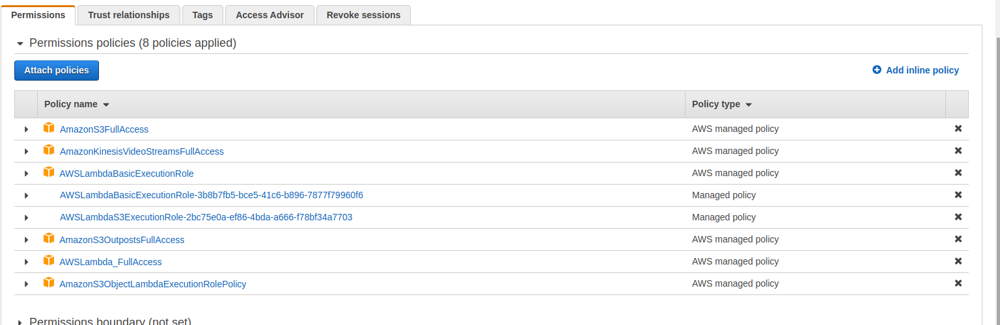

<!-- TABLE OF CONTENTS -->
## Table of Contents

* [About the Project](#about-the-project)
* [Prerequisites](#prerequisites)
* [Getting Started](#getting-started)
  * [Steps to build OpenCV Library](#Steps-to-build-OpenCV-Library)
  * [Steps to Build Boto3](#Steps-to-Build-Boto3) 
  * [Steps to Build Pybind11](#Steps-to-Build-Pybind11)
  * [Step to Build liblog4cplus-dev](#Steps-to-Build-liblog4cplus-dev)
  * [Set up AWS Services](Set-up-AWS-Services)
  * [Steps to Build Amazon Kinesis Video Streams CPP Producer](Steps-to-Build-Amazon-Kinesis-Video-Streams-CPP-Producer)
* [Usage](#usage)
* [Contributors](#contributors)

<!-- ABOUT THE PROJECT -->
## About The Project
This project is intended to build and deploy a hybrid video analytic application onto Turbo X (based on QCS610) open kit that streams video to the AWS Kinesis video stream using kvssink gstreamer plugin. The application also analyses the video stream that require low computation power at the edge and delegates the high computational analytic task to cloud.

## Prerequisites

1. Install Android Platform tools (ADB, Fastboot) 

2. Setup Yocto LE PDK in the host system. 

3. Setup the Wifi (Page 12 of [Linux User Guide](https://www.thundercomm.com/app_en/product/1593776185472315))

4. Download and Install the App Tool chain SDK. (Setup instructions can be found in [Application SDK User Manual](https://www.thundercomm.com/app_en/product/1593776185472315)).

5. Setup the [SNPE SDK](https://developer.qualcomm.com/docs/snpe/setup.html) in the host system. You can download SNPE SDK [here](https://developer.qualcomm.com/software/qualcomm-neural-processing-sdk).

6. Setup AWS account.

<!-- GETTING STARTED -->
## Getting Started

To get a local copy up and running follow these steps.
1. Clone the  project repository from the github to host system.
```sh
$ mkdir hybrid-vi-build && cd hybrid-vi-build
$ git clone <project-repo>
```

2. Create a directories named opencv, pybind11, log4cplus, boto3 inside hybrid-vi-build folder for keeping header and library files.
```sh
$ mkdir opencv pybind11 log4cplus boto3
```

### Steps to build OpenCV Library
To build opencv library for the target board in yocto environment , utilize the meta recipes for opencv present in the file poky/meta-openembedded/meta-oe/recipes-support/opencv/opencv_3.4.5.bb.
1. To integrate an opencv, first we have to source the cross compilation environment  in the host system. For that navigate to yocto working directory and execute below commands:
```sh
<working directory>$ export  SHELL=/bin/bash
<working directory>$ source poky/qti-conf/set_bb_env.sh
```

2. Select “qcs610-odk meta-qti-bsp” from the available machines menu. On selecting the machine, the next ncurses menu starts. Select “qti-distro-fullstack-perf meta-qti-bsp” from the Available Distributions  menu. After this shell prompt will move to following directory: <working directory>/build-qti-distro-fullstack-perf 

3. As mentioned earlier bb file of opencv is already present and we just need to build the image by running bitbake opencv:
```sh
<working directory>/build-qti-distro-fullstack-perf $ bitbake opencv
```

4. After the completion of the build process, copy the header files and library files to the opencv directory which we have created earlier in the project directory.
```sh
$ cp -r <build_directory>/tmp-glibc/sysroots-components/armv7ahf-neon/opencv/usr/lib/ <build_directory>/tmp-glibc/sysroots-components/armv7ahf-neon/opencv/usr/include/  ~/hybrid-vi-build/opencv
```
### Steps to Build Boto3
To install the boto3 package on qcs610, you need to build and install the following python3 packages:

- python3-boto3
- python3-botocore
- python3-jmespath

Steps to build Boto3 are as follows:
1. Meta recipes of the packages mentioned above can be found [here]("https://github.com/intel-iot-devkit/meta-iot-cloud"). Place the above mentioned bb recipe in the given directory. "poky/poky/meta-openembedded/meta-python/python/".

2. Run the bitbake command for installing boto3 packages.
```sh
<working directory>/build-qti-distro-fullstack-perf $ bitbake python3-boto3
```

3. Once the build is complete, the shared library and header files will be available in “./tmp-glibc/sysroots-components/armv7ahf-neon/python3-boto3/usr”.  Copy these files to the boto3 directory in hybrid-vi-build.
```sh
$ cp ./tmp-glibc/sysroots-components/armv7ahf-neon/python3-boto3/usr/lib  ~/hybrid-vi-build/boto3
```
4. Make sure you have copied and transfer all the dependency libraries required for building the boto3 package. Required dependencies are mentioned in the ‘RDEPENDS’ section of the bitbake file(.bb file or .inc file).

### Steps to Build Pybind11
Pybind11 is a lightweight header-only library that exposes C++ types in Python and vice versa, mainly to create Python bindings of existing C++ code. Step to build pybind11 are as follows.
1. Meta recipes of pybid11 can be found in meta-recipe from source repository. Place the all pbind11 related bb recipe in the given directory. "poky/poky/meta-openembedded/meta-python/python/". 

2. Run the bitbake command for installing pybind11 packages. 
```sh
<build_directory>/$ bitbake pybind11 
```

3. Once the build is complete, the shared library and header files will be available in “./tmp-glibc/sysroots-components/armv7ahf-neon/python3-pybind11/usr”.  Copy these files to the pybind11 directory in hybrid-vi-build.
```sh
$ cp ./tmp-glibc/sysroots-components/armv7ahf-neon/ pybind11/usr/lib ~/hybrid-vi-build/pybind11
```
4. Make sure you have copied and transfer all the dependency libraries required for building the pybind11 package. Required dependencies are mentioned in the ‘RDEPENDS’ section of the bitbake file(.bb file or .inc file).

### Step to Build liblog4cplus-dev
log4cplus is a simple to use C++ logging API providing thread-safe, flexible, and arbitrarily granular control over log management and configuration. It is modeled after the Java log4j API. Step to build liblog4cplus-dev are as follows.  

2. Run the bitbake command for installing liblog4cplus-dev packages.
```sh
<build_directory>/$ bitbake log4cplus
```

3. Once the build is complete, the shared library and header files will be available in “./tmp-glibc/sysroots-components/armv7ahf-neon/ log4cplus /usr”.  Copy these files to the log4cplus directory in hybrid-vi-build.
```sh
$ cp ./tmp-glibc/sysroots-components/armv7ahf-neon/ log4cplus /usr/lib ~/hybrid-vi-build/log4cplus
```

4. Make sure you have copied and transfer all the dependency libraries required for building the log4cplus package. Required dependencies are mentioned in the ‘RDEPENDS’ section of the bitbake file(.bb file or .inc file). 

### Set up AWS Services
For this project, we will be using AWS S3, kinesis video stream and lambda serves. 
1. Sign in to the AWS Management Console and open the Amazon S3 console and follow the step given [here](https://docs.aws.amazon.com/AmazonS3/latest/userguide/create-bucket-overview.html) to create a two S3 bucket with names as inbucket and outbucket. Also notedown these name in the config file
2. In order to create lambda function, first we need to create a custom execution role with following policies. (Refer [here](https://docs.aws.amazon.com/lambda/latest/dg/lambda-intro-execution-role.html) for creating custom execution policy)



3. Create a lambda function using AWS console as specified [here](https://docs.aws.amazon.com/lambda/latest/dg/getting-started-create-function.html). While creating lambda function select runtime as python 3.6 and execution role as the one created in last step.
4. Now replace the template code of lambda function with that of the source code given in the lambda.py in the project directory. Add utils.py in the project directory to the lambda code directory

5. Next step is to create and upload lambda layers. Lambda layers provide a convenient way to package libraries and other dependencies that you can use with your Lambda functions. In our lambda function we will be using following python packages:
a) boto3 </br>
b) av </br>
c) pillow==6.1.0 </br>
d) onnxruntime </br>
Steps for creating lambda layers for above packages are as follows.
    a) Create an AWS sagemaker  instance as specified [here](https://docs.aws.amazon.com/sagemaker/latest/dg/howitworks-create-ws.html). </br>
    b) Clone [LambdaZipper](https://github.com/tiivik/LambdaZipper) github repository to the sagemaker Notebook instance as specified [here](https://docs.aws.amazon.com/sagemaker/latest/dg/studio-tasks-git.html). </br> 
    c) Build the docker image in the sagemaker instance by following command
    ```sh
    docker build -t my-lambda .
    ```
    d) Now run the following command for each of the packages to create a lambda layer in .zip format
    ```sh
    docker run --rm -v $(pwd):/package tiivik/lambdazipper MYPACKAGE
    ```
    e) Now download each of these .zip files to local system. Next open the layers page of Lambda console and following the steps mentioned [here](https://docs.aws.amazon.com/lambda/latest/dg/configuration-layers.html) to create custom layers for each of the required packages.
    f) Now open your lambda function page in aws console and attach these layers to our lambda function by following the steps given [here](https://docs.aws.amazon.com/lambda/latest/dg/invocation-layers.html).
         g) stop the sagemaker notebook instance 

    6. Now select “Add trigger” option in the console to configure the S3 bucket to trigger lambda function. Make sure the selected bucket should not take any output results, it will leads to recursive effect.  
    7. set PYTHONPATH environmental variable to /opt/ on configuration section of lambda service

Note: Make sure AWS region is same across the every aws service we use in this project.


   $ adb push ../../hybrid-vi-build/ /data/

### Steps to Build Amazon Kinesis Video Streams CPP Producer
Amazon Kinesis Video Streams Producer SDK for C/C++ makes it easy to build an on-device application that securely connects to a video stream, and reliably publishes video and other media data to Kinesis Video Streams. Step to build sdk are as follows:
 
1. Clone the CPP Producer SDK to project directory: 
```sh
$ git clone https://github.com/awslabs/amazon-kinesis-video-streams-producer-sdk-cpp.git
``` 

2. Prepare a build directory in the newly checked out repository
```sh
$ mkdir -p amazon-kinesis-video-streams-producer-sdk-cpp/build
$ cd amazon-kinesis-video-streams-producer-sdk-cpp/build
``` 

3. Include log4cplus shared library to build environment, copy the shared library to “/usr/local/oecore-x86_64/environment-setup-armv7ahf-neon-oe-linux-gnueabi/usr/lib/” 

4. Make sure the App Toolchain SDK for cross compilation is ready as explained during building python wrapper. Run cmake from build folder.
```sh
$  source /usr/local/oecore-x86_64/environment-setup-armv7ahf-neon-oe-linux-gnueabi
```

5. Run cmake
 ```sh
 $ cmake -DBUILD_GSTREAMER_PLUGIN=TRUE -DBUILD_DEPENDENCIES=FALSE -DALIGNED_MEMORY_MODEL=TRUE ..
```

6. After running cmake, in the same build directory run make to compile.
```sh
$ make
```

7. Create a directory named library and copy the .so files (libgstkvssink.so, libKinesisVideoProduer.so)in build and also in dependency directory(.so files in libkvscproducer and libkvspic directory) to library

8. Now push build directory to board.
```sh
$ adb push ~/hybrid-vi-build/ /data/
$adb push build/ /data/hybrid-vi-build
$adb push library/ /data/hybrid-vi-build
```
9. Before running the application set the board environment by following steps: </br>
    a) In the host system, enter following adb commands
      ```sh
      $ adb root
      $ adb remount
      $ adb shell mount -o remount,rw /
      ```

      b) Enable Wifi connectivity on the board by executing following commands </br>
        ```
        $ adb shell
        /# wpa_supplicant -Dnl80211 -iwlan0 -c /etc/misc/wifi/wpa_supplicant.conf -ddddt &
        /# dhcpcd wlan0
        ```

      c) Set the latest UTC time and date in the following format </br>
        ```
        /# date -s '2021-02-20 10:07:00'
        ```
        </br>
      d) Set the LD_LIBRARY_PATH </br>
        ```
        /# export GST_PLUGIN_PATH=/data/hybrid-vi-build/build
        /# export LD_LIBRARY_PATH=$LD_LIBRARY_PATH:/data/hybrid-vi-build/library:/data/hybrid-vi-build/opencv:/data/hybrid-vi-build/log4cplus:/data/hybrid-vi-build/pybind11
       ```
10. Check whether kvssink plugin is working by executing following command:
```
/# gst-inspect-1.0 kvssink
```
You should get information on the plugin.

Note: For each time new shell enviromen is open, one need to set LD_LIBRARY_PATH manually.
<!-- USAGE -->
## Usage
Before starting application make sure you have updated the config.json file in the project directory, update the following details regarding aws_access_key, aws_secret_key, aws_region and also update credential in camera_pipeline marked as xxxx. 

- upload the model into s3 bucket
     - upload the face detection and emotion detection onnx model given in source repository to s3 bucket 
```  
$ cd /data/hybrid-vi-build/
$ python3.5 upload_model.py
```
- Run the code to start the video stream
```
   $ python3.5 inference.py
```
     - This code will initiate kinesis video stream and send frame to aws cloud and also perform inference on qcs610 device. whenever it detect any intruder/person, it will send the timestamp.json(producer time stamp) to s3 inbucket, this will trigger the lambda service, In lambda it will download video chunk from kinesis video stream and perform inference and store result to s3 outbucket. The output folder structure is as below
```
	outbucket 
       - 14-12-2021                          # data folder
                - 15:12:14                     #  time folder
                         - Image1.jpg         # inference result (1fps)
                         - Image2.jpg         # inference result (1fps)
                         - Image3.jpg         # inference result (1fps)
                          - video.mp4         # video chunk from kvs
```
- where video.mp4 is actual input video and all images are inference outputs  

## Note:
- In this project, we have performed inference on lambda, however for bigger model one can chose sagemaker endpoint to inference.
- Lambda service has an limitation of 256mb memory, because of this we have not included opencv, ffmpeg library. if you want include more library you need to chose amazon efs service and mount file system on lambda.
- In this project we are showing intruder detection example, it can be extend to many other application as well. 


